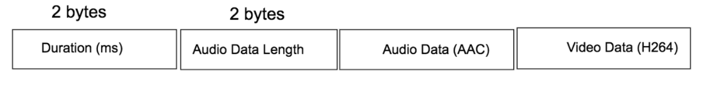

jMuxer
-------
jMuxer - a simple javascript mp4 muxer for non-standard streaming communications protocol. Basically it does not care about communication protocol and it is simply a javscript mp4 remuxer intended to pay media file in the browser using media source extension. It expects raw H264 video data and AAC audio data in ADTS container as an input.

What was the purpose to develop?
-------
It was needed to play raw H264 and AAC data coming from live streaming encapsulated into a custom transport container in a project. Each chunk would contain its duration, audio data and video data with simple 4 bytes header. Please check example section to check packet format. After struggling several days with few open source projects like hls.js, I have eneded up to make a new one that would be more simpler and minimalist to achieve my goal.

Live Demo
-------
[Click here](https://samirkumardas.github.io/jmuxer/) to view a working demo


How to use?
-------

   a distribution version is available on dist folder.
   
```html
  <script type="text/javascript" src="dist/jmuxer.min.js"></script>
  
  var jmuxer = new JMuxer(option);
```

Available options are:

*node* - String. ID of video tag. Required field.   

*mode* - Available values are: both, video and audio. Default is both

*flushingTime* - Buffer flushing time in seconds. Default value is 1500 miliseconds.

*clearBuffer* - true/false. Either it will clear played media buffer automatically or not. Default is true. 

*fps* - Optional value. Frame rate of the video if it is known/fixed value. It will be used to find frame duration if chunk duration is not available with provided media data. 

*debug* - true/false. Will print debug log in browser console. Default is false.

**Complete example:**

```html
   
   <script type="text/javascript" src="dist/jmuxer.min.js"></script>
   
   <video id="player"></video>
   
   <script>
       var jmuxer = new JMuxer({
           node: 'player',
           debug: false
       });

      /* Now feed media data using feed method. audio and video is buffer data and duration is in miliseconds */
      jmuxer.feed({
         audio: audio,
         video: video,
         duration: duration
       });
   
   </script>

```

Media dataObject may have folloiwng properties:

*video* - h264 buffer 

*audio* - AAC buffer

*duration* - duration in miliseconds of the provided chunk. If duration is not provided, it will calculate frame duration wtih the provided frame rate (fps).


**Available Methods**

| Name        | Parameter           | Remark  |
| ------------- |:-------------:| -----:|
| feed      |  data object      |  object properites may have audio, video and duration. At least one media property i.e audio or video must be provided. If no duration is provided, it will calculate duration based on fps value |
| destroy | -      |    Destroy the jmuxer instance and release the resources |
  
 **Compatibility**
 
 compatible with browsers supporting MSE with 'video/MP4. it is supported on:

 * Chrome for Android 34+
 * Chrome for Desktop 34+
 * Firefox for Android 41+
 * Firefox for Desktop 42+
 * IE11+ for Windows 8.1+
 * Edge for Windows 10+
 * Opera for Desktop
 * Safari for Mac 8+

Demo Server and player example
-----------
A simple node server with demo media data is available on example directory. Each media chunk is encapsulated with 4 bytes header where first two bytes is chunk duration and remaining two bytes is audio data length. Packet format is shown in image below:

**Packet format**



**How to run example?**

Demo files are avaiable in example directory. For running the example, first run the node server by following command:

*cd example*

*node server.js*

then, visit *example/index.html* page using any webserver.


Player Example for raw h264 only
-----------

Assuming you are still on `example` directory. Now run followngs:

*node server-h264.js*

then, visit *example/index-h264.html* page using any webserver.


**How to build?**

A distribution version is available inside *dist* directory. However, if you need to build, you can do as follows:

 1. git clone https://github.com/samirkumardas/jmuxer.git
 2. cd jmuxer
 3. npm install
 4. npm run build OR npm run pro
 
 
Credits
-----------
Proudly inspired by [hls.js](https://github.com/video-dev/hls.js), [rtsp player](https://github.com/Streamedian/html5_rtsp_player) :) 
